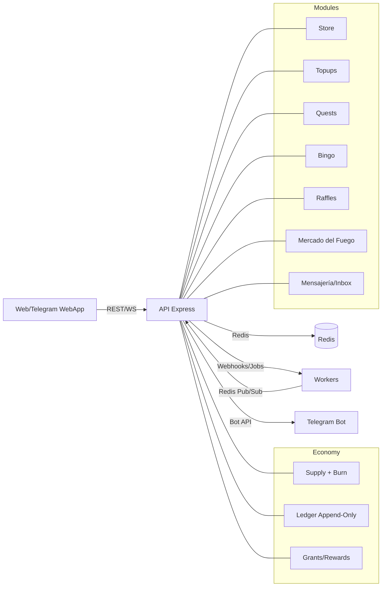

# Arquitectura — Casino Virtual Modular

## Visión general
- Backend Node.js/Express, Redis (saldos/cache/eventos), Socket.io (tiempo real), HTTP REST y SSE donde aplique.
- Integraciones: Telegram WebApp (payload firmado), fallback Web con email/clave, Bot para lectura de mensajes (coins).
- Diseño “blockchain-ready”: capa de economía y ledger modular; tiendas/juegos se registran como nodos lógicos.

## Componentes
- **Identity**: Telegram + email/clave (JWT); vinculación de identidades.
- **Economy**: Fuegos/Coins, supply, burn, fees, grants, ledger (append-only), auditorías.
- **Store**: verificación de usuario, checkout idempotente, burn, recompensas.
- **Topups**: solicitudes, aprobación admin, comisión y acreditación.
- **Quests**: configuración por segmento, validación y recompensa.
- **Games**: Bingo (reglas de sesión), Rifas (Fuego/Premio), extensible.
- **Messaging**: bandeja de entrada, notificaciones, chat/logs generales y por sala.
- **Admin/Config**: flags, paneles, colas, reportes.

## Diagrama (alto nivel)

## Sesiones y reconexión (Bingo)
- Usuario mantiene estado de sala aunque cierre app; “sala pineada” en lobbys (principal y del juego) hasta finalizar.
- Restricción: 1 sala activa por usuario (server-side guard).
- Socket reconnection handlers + persistencia mínima en Redis.

## Lectura de mensajes de Telegram → Coins
- Bot lee mensajes del grupo oficial y los asocia por `userId` vinculado.
- Se almacenan contadores/actividad y se acreditan Coins periódicamente (jobs/cron) con topes por día.

## Idempotencia y consistencia
- `Idempotency-Key` obligatorio en `/store/checkout` y `/topup/fuegos`.
- Uso de `WATCH/MULTI` o transacciones atómicas en Redis para saldos/supply.

## Despliegue y observabilidad
- Railway/Cloud, con logs estructurados, métricas y alertas.
- Feature flags por entorno, QA bypass limitado a `ALLOW_TEST_RUNNER=true` + header.
